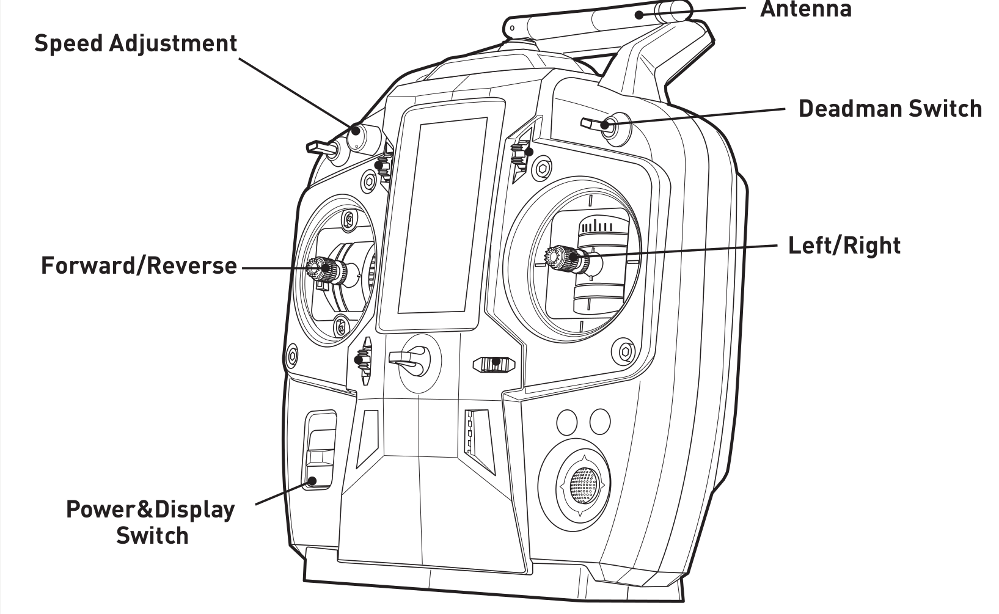

Driving Warthog
=================

There are three ways to drive Warthog, and each way will work on a physical Warthog robot as well as on a simulated Warthog.

The first two ways are teleoperation using a remote controller, and manually through publishing ROS messages. These two ways are covered in this section.

The third way is using the interactive controller in rviz. This is covered in the :doc:`Simulation <Simulating>` section.

Safety Precautions
----------------------

.. Warning::

    Warthog is capable of reaching high speeds. Careless driving can cause harm to the operator, bystanders, the robot, or other property. Always remain vigilant, ensure you have a clear line of sight to the robot, and operate the robot at safe speeds.

Driving with Remote Controller
-------------------------------

Warthog uses a standard Futaba remote control radio transmitter. To operate the remote, first power it on by sliding the power switch to the ON position, as indicated in the image below:

.. warning

    The speed adjustment knob in the upper-left should be turned completely counterclockwise while familiarizing yourself with the operation of the remote. Turn the knob slowly clockwise to get the robot moving.

To drive the Warthog, the spring-loaded deadman switch in the upper-right corner must be held down. Releasing this switch will prevent the robot from moving.

The lever on the left controls the robot's speed and the lever on the right controls the robot's rotation.

Driving with ROS Messages
--------------------------

You can manually publish ``geometry_msgs/Twist`` ROS messages to either the ``/warthog_velocity_controller/cmd_vel`` or the ``/cmd_vel`` ROS topics to drive Warthog. 

For example, in terminal, run:

.. code-block:: bash

	rostopic pub /warthog_velocity_controller/cmd_vel geometry_msgs/Twist '{linear: {x: 0.5, y: 0.0, z: 0.0}, angular: {x: 0.0, y: 0.0, z: 0.0}}'

The command above makes Warthog drive forward momentarily at 0.5 m/s without any rotation. 

Emergency Stop
---------------

**E-Stop Remote**

Warthog includes a remote E-Stop, which looks like this:

.. image:: images/wireless-stop-remote.png
   :alt: Warthog's E-Stop remote

To operate the E-Stop:

#. Twist the red button in the direction indicated by the arrows to take it out of the stopped state
#. Press and hold the green START button until the battery LED indicator turns green
#. Press the button labelled "RELEASE" with 3 seconds, followed by the START button again

The battery LED should now rapidly blink green, indicating that is is paired with the receiver on the robot. To disengage the E-Stop, press START once again.

If for any reason the robot must be halted immediately, press the red STOP button. This will immediately cut power to the robot's motors.

During teleoperation, we recommend having at least two people present and monitoring the robot at all times: one using the remote control, and the second operating the E-Stop remote.

**E-Stop Buttons**

Warthog has four E-Stop buttons located on the four corners of the robot. Pressing any of these
buttons will cut power to the motors, just like the STOP button on the E-Stop remote. To disengage the E-Stop, simply twist the button in the direction indicated by the arrows.

Whenever you need to perform maintenance on Warthog, we recommend engaging the E-Stop if the robot cannot be fully powered down.

Pinch Points
-------------

Warthog's chassis has articulated suspension.  Do not place fingers, or anything else, anywhere along the suspension
link, as it can result in injury.

.. image:: images/pinch_points.jpg
    :alt: Warthog's pinch points

If you need to access the area around the suspension link for maintenance purposes, place the robot securely on
blocks and engage the emergency-stop to prevent the robot from moving.
