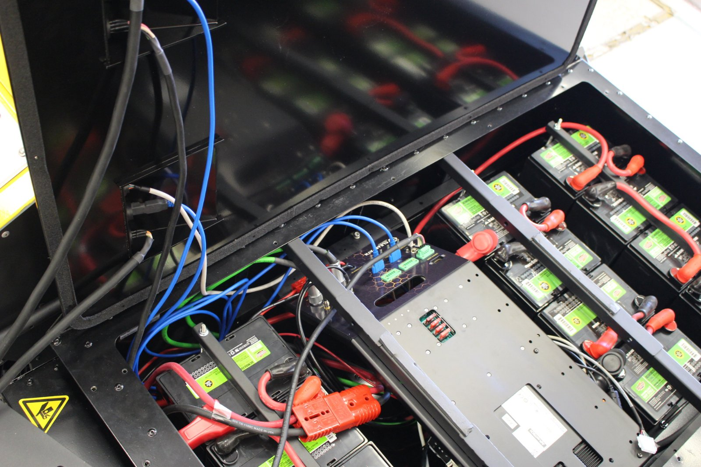
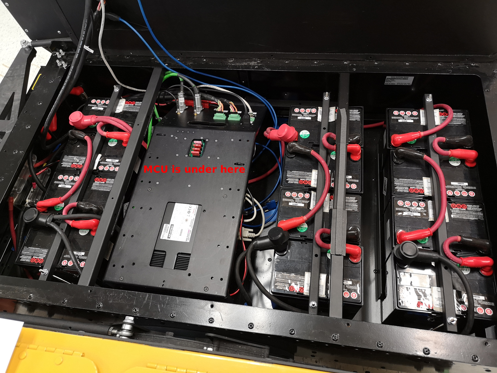
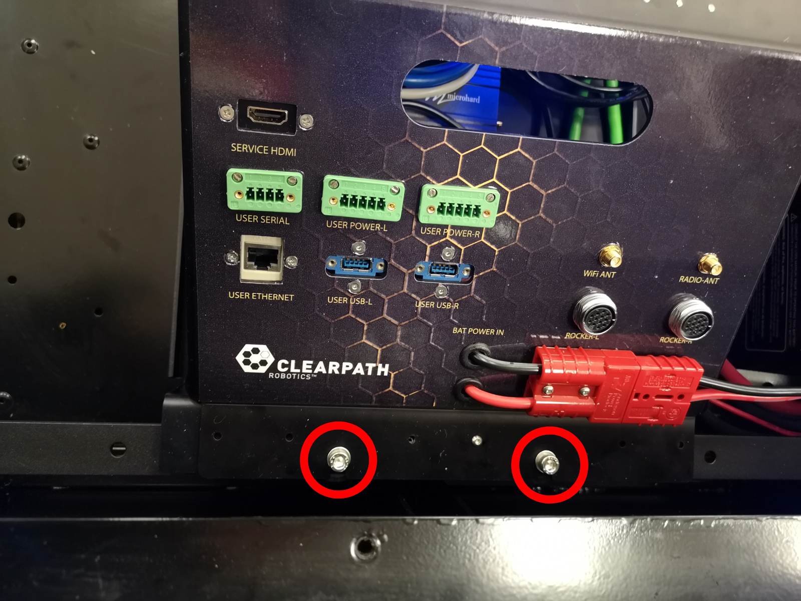
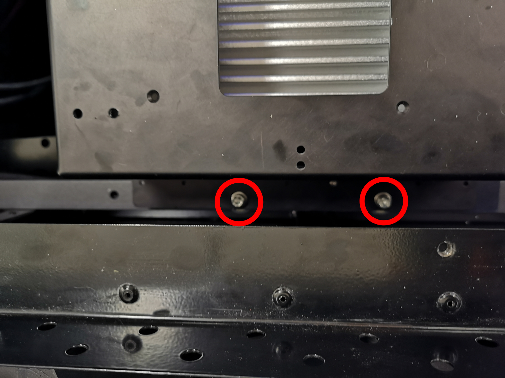
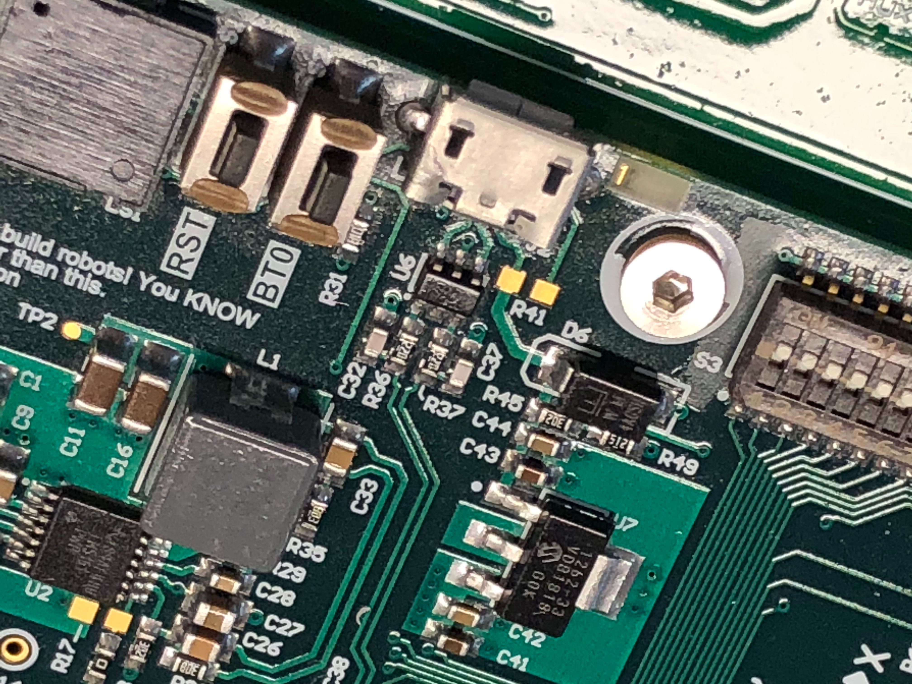

Keeping Warthog Updated
==========================

.. note:: If you are upgrading your Warthog from an older version of ROS, please refer to `our upgrade instructions here <https://clearpathrobotics.com/assets/guides/noetic/melodic-to-noetic/index.html>`_.

Warthog is always being improved, both its own software and the many community ROS packages upon which it depends! You can use the apt package management system to receive new versions all software running on the Warthog.

Getting New Packages
--------------------

Each Warthog leaves the factory already configured to pull packages from http://packages.ros.org as well as http://packages.clearpathrobotics.com. To update your package and download new package versions make sure that Warthog is connected to the internet and run the following commands:

.. code-block:: bash

    sudo apt-get update
    sudo apt-get dist-upgrade

If you see any errors, please `get in touch`_ and we'll see if we can get you sorted out.

.. _get in touch: https://support.clearpathrobotics.com/hc/en-us/requests/new

MCU Firmware Update
-------------------

.. warning::

    Accessing Warthog's MCU requires access to several hard-to-get-to parts of the robot.  Unless absolutely
    necessary, we do not recommend re-flashing the robot's MCU firmware.

You need to use an external PC to update Warthog's MCU firmware.  You cannot use Warthog's internal PC, as installing the
firmware requires power-cycling the MCU.  Warthog's MCU controls the power supply to the internal PC.  These instructions
assume the external PC is running some flavour of Linux with access to Clearpath's ROS packages.

Follow the below procedure to flash the firmware to Warthog's MCU:

1. Place Warthog up on blocks and/or engage the emergency stop by pressing one of the red buttons located on each corner
   of the robot. Firmware loading does not usually result in unintended motion, but it's safest to ensure the robot
   cannot move accidentally.
2. Download the Warthog firmware package onto your PC:

.. code-block:: bash

    sudo apt-get install ros-noetic-warthog-firmware

3. Remove the top panel from the Warthog.  We recommend opening the panel to the left, as there are cables that run
   into the lid which can be strained.

4. Warthog's MCU is located on the underside of the metal frame over the top of the PC.  To access it you will need to
   disconnect all cables from the breakout on the sloped portion on the left and then undo 4 screws anchoring the frame:

Once the screws are removed, carefully lift the center panel and turn it over to expose the MCU's micro USB port
and buttons.

5. While pressing ``BT0`` on the MCU, connect the external PC to Warthog's MCU using a USB cable.

6. After connecting the PC you should see a device with a name similar to
   ``Bus 001 Device 005: ID 0483:df11 STMicroelectronics STM Device in DFU Mode`` in the output of ``lsusb``.

.. note::

    If the MCU does not show up as a DFU device in the output of ``lsusb`` after completing the above procedure, press
    and hold BT0 on the MCU press the RST button while holding BT0 down.  This will reset the MCU and force it into DFU
    mode.

With the MCU in DFU mode, run the following command, replacing ``001/005`` with the value appropriate to the Bus and
Device where Warthog's MCU is connected:

.. code-block:: bash

    sudo chmod 666 /dev/bus/usb/001/005

Now run the following command to upload the firmware:

.. code-block:: bash

    dfu-util -v -d 0483:df11 -a 0 -s 0x08000000 -D /opt/ros/noetic/share/warthog_firmware/mcu.bin

You should see about 20 seconds worth of lines output beginning with "Download from image ...". When this is
complete you may disconnect the PC from the MCU and power-cycle the robot.