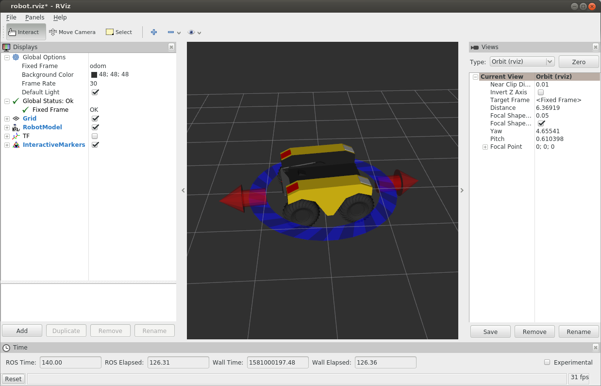

Simulating Warthog
====================

Whether you actually have a physical Warthog robot or not, the Warthog simulator is a great way to get started with ROS robot development. In this tutorial, we will go through the basics of starting Gazebo and rviz and how to drive your Warthog around.

.. note::

  Before you can use this tutorial, make sure you have :doc:`installed Warthog's software <Installing>`

Launch Gazebo
-------------

Gazebo is the most common simulation tool used in ROS. Warthog's model in Gazebo include reasonable
approximations of its dynamics, including wheel slippage, skidding, and inertia. To launch simulated Warthog in a simple example world, run the following command:

.. code-block:: bash

    roslaunch warthog_gazebo warthog_world.launch

You should see the following window appear, or something like it. You will see a base Warthog spawned with no additional sensors. You can adjust the camera angle by clicking and dragging while holding CTRL, ALT, or the shift key:

The window which you are looking at is the Gazebo Client. This window shows you the "true" state of the simulated world which the robot exists in. It communicates on the backend with the Gazebo Server, which is doing the heavy lifting of actually maintaining the simulated world. At the moment, you are running both the client and server locally on your own machine, but some advanced users may choose to run heavy duty simulations on separate hardware and connect to them over the network.

.. note::

    When simulating, you must leave Gazebo running. Closing Gazebo will prevent other tools, such as rviz (see below) from working correctly.

Launch rviz
-----------

The next tool we will encounter is :roswiki:`rviz`. Although superficially similar in appearance to Gazebo, rviz has a very different purpose. Unlike Gazebo, which shows the reality of the simulated world, rviz shows the robot's *perception* of its world, whether real or simulated. So while Gazebo won't be used with your real Warthog, rviz is used with both.

You can using the following launch invocation to start rviz with a pre-cooked configuration suitable for visualizing any standard Warthog config:

.. code-block:: bash

    roslaunch warthog_viz view_robot.launch

You should see rviz appear:

The rviz display only shows what the robot knows about its world, which presently, is nothing. Because the robot doesn't yet know about the barriers which exist in its Gazebo world, they're not shown here.

Driving with Interactive Controller
------------------------------------

Rviz will also show Warthog's interactive markers around your Warthog's model. These will appear as a blue ring and red arrows. Depending on your robot, there will also be green arrows. If you don't see them in your rviz display, select the Interact tool from the top toolbar and they should appear. 

Drag the red arrows in rviz to move in the linear x direction, and the blue circle to move in the angular z direction. If your robot supports lateral/sideways movement, you can drag the green arrows to move in the linear y direction. Rviz shows you Warthog moving relative to its odometric frame, but it is also moving relative to the simulated world supplied by Gazebo. If you click over to the Gazebo window, you will see Warthog moving within its simulated world. Or, if you drive real Warthog using this method, it will have moved in the real world.