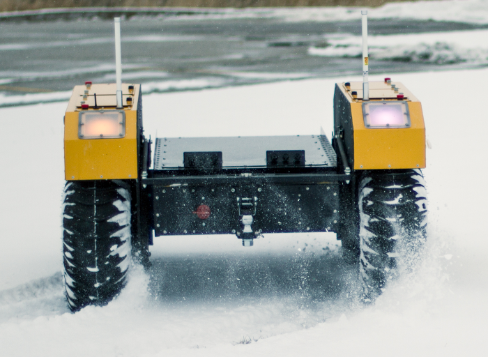

Status Indicators
==================

Warthog has four configurable LEDs on the corners of the chassis. These lights are used to indicate the robot's status.

Corner LEDs
-------------

The corner LEDs use the following patterns to indicate the robot's status:

===============  ===============  ====================
Front LEDs       Rear LEDs        Description
===============  ===============  ====================
Solid white      Solid red        Normal operation.
Pulsing orange   Pulsing orange   Battery is low.
Flashing orange  Flashing orange  Fault.
Flashing red     Flashing red     E-Stop is engaged.
Solid red        Solid red        ROS is not running. Possibly because unable to contact MCU, or firmware malfunction, or initialization error.
===============  ===============  ====================

While the robot is in the normal operation state the LED colors can be customized by publishing to the ``/cmd_lights``
topic.  In any other state LED customization is disabled.           

