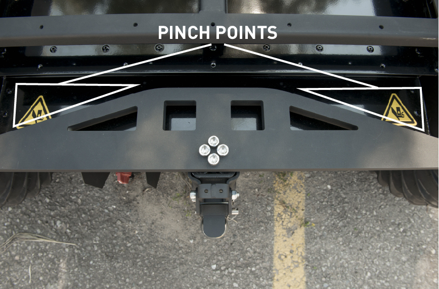

Driving Warthog
=================

.. image:: graphics/warthog_driving_banner.png
    :alt: Warthog Driving

Warthog can either drive autonomously, be :doc:`controlled through ROS messages <WarthogSimulation>`, or you
can use the supplied remote control to teleoperate it.

Safety Precautions
----------------------

.. warning::

    Warthog is a large, heavy, robot capable of reaching high speeds.  Careless driving can cause harm to the operator,
    bystanders, the robot, or other property.  Always remain vigilant, ensure you have a clear line of sight to the
    robot, and operate the robot at safe speeds.

Remote Control
-----------------

Warthog's uses a standard Futaba remote control radio transmitter.  To operate the remote, first power it on by sliding
the power switch to the ON position, as indicated in the image below:

.. warning

    The speed adjustment knob in the upper-left should be turned completely counterclockwise while familiarizing
    yourself with the operation of the remote.  Turn the knob slowly clockwise to get the robot moving.

.. image:: graphics/futaba.png
   :alt: Warthog's remote control

To drive the robot, the spring-loaded deadman switch in the upper-right corner must be held down.  Releasing this
switch will prevent the robot from moving.

The lever on the left controls the robot's speed and the lever on the right controls the robot's rotation.

E-Stop Remote
----------------

Warthog includes a remote emergency-stop ("e-stop"), which looks like this:

To operate the e-stop:

#. Twist the red button in the direction indicated by the arrows to take it out of the stopped state
#. Press and hold the green START button until the battery LED indicator turns green
#. Press the button labelled "RELEASE" with 3 seconds, followed by the START button again

The battery LED should now rapidly blink green, indicating that is is paired with the receiver on the robot.  To
disengage the stop, press START once again.

If for any reason the robot must be halted immediately, press the red STOP button.  This will immediately cut
power to the robot's motors.

During teleoperation we recommend having at least two people present and monitoring the robot at all times: one using
the remote control, and the second operating the e-stop remote.

E-Stop Buttons
-------------------

Warthog is also equipped with 4 emergency stop buttons, located on the 4 corners of the robot.  Pressing any of these
buttons will cut power to the motors, just like the STOP button on the e-stop remote.  To disengage the emergency
stop, simply twist the button in the direction indicated by the arrows.

Whenever you need to perform maintenance on the robot we recommend engaging the emergency-stop if the robot cannot be
fully powered down.

Body Lights
--------------

Warthog includes four RGB LED panels, located on the four corners of the chassis.  These lights express system status
according to the table below.  In the absence of any of the low-level conditions, they can be commanded from ROS
to display indications from autonomy or other high-level software.

=======================   ========================================================================================================================================================================
Color                     Meaning
=======================   ========================================================================================================================================================================
Solid Red                 MCU is not in contact with the PC.  Possibly due to a loose cable, firmware malfunction, or initialization error.
Flashing Red              E-Stop is engaged.  Disenage the emergency stop to clear.
Flashing Yellow           Motor drivers are initializing.  There is a short initialization period after startup and after disengaging the e-stop during which the robot cannot drive
Headlights & Taillights   The front lights are solid white, rear lights are solid red.  This indicates the robot is in normal operation.  NOTE: only in this state can the lights be overridden by autonomy or other software.
=======================   ========================================================================================================================================================================

.. image:: graphics/warthog_taillights.png
   :alt: Warthog's taillight

Pinch Points
-------------------

Warthog's chassis has articulated suspension.  Do not place fingers, or anything else, anywhere along the suspension
link, as it can result in injury.

If you need to access the area around the suspension link for maintenance purposes, place the robot securely on
blocks and engage the emergency-stop to prevent the robot from moving.
