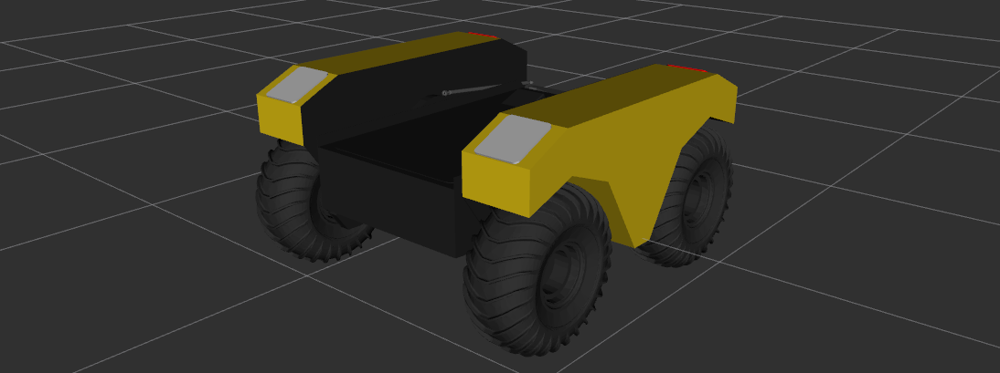

Configuration & Environment Variables
=========================================

The warthog_description package is the URDF robot description for Warthog UGV.

.. _Source: https://github.com/warthog-cpr/warthog

Overview
---------

This package provides a `URDF <http://wiki.ros.org/urdf>`_ model of Warthog.  For an example launchfile to use in visualizing this model, see `warthog_viz <http://wiki.ros.org/warthog_viz>`_.

Accessories
------------

Warthog has a suite of optional payloads called accessories. These payloads can be enabled and placed on the robot using environment variables specified at the time the `xacro <http://wiki.ros.org/xacro>`_ is rendered to URDF. Available accessory vars are:

.. raw:: html

  <table><tbody>
    <tr> <td>
<strong>Variable</strong> 
</td>
      <td>
<strong>Default</strong> 
</td>
      <td>
<strong>Description</strong> 
</td>
    </tr>
    <tr>  <td>
<tt>WARTHOG_ARM_MOUNT</tt> 
</td>
      <td>
<tt>0</tt> 
</td>
      <td>
If enabled, a link called "arm_mount_link" will be created on the bulkhead
</td>
    </tr>
    <tr>  <td>
<tt>WARTHOG_BULKHEAD</tt> 
</td>
      <td>
<tt>0</tt> 
</td>
      <td>
Switch for enabling a large, rigid bulkhead on the front of the warthog for mount accessories like arms
</td>
    </tr>
    <tr>  <td>
<tt>WARTHOG_IMU_RPY</tt> 
</td>
      <td>
<tt>0 0 0</tt> 
</td>
      <td>
Compound rotations in radians of the IMU
</td>
    </tr>
    <tr>  <td>
<tt>WARTHOG_IMU_XYX</tt> 
</td>
      <td>
<tt>0 0 0</tt> 
</td>
      <td>
Position of the IMU in meters
</td>
    </tr>
    <tr>  <td>
<tt>WARTHOG_JOY_TELEOP</tt> 
</td>
      <td>
<tt>0</tt> 
</td>
      <td>
Switch to enable teleop control of the platform
</td>
    </tr>
    <tr>  <td>
<tt>WARTHOG_NAVSAT_SMART6</tt> 
</td>
      <td>
<tt>0</tt> 
</td>
      <td>
Is the platform equipped with a Smart7 GPS?
</td>
    </tr>
    <tr>  <td>
<tt>WARTHOG_NAVSAT_SMART6_BAUD</tt> 
</td>
      <td>
<tt>57600</tt> 
</td>
      <td>
Sets the baud rate for serial communication with the GPS module
</td>
    </tr>
    <tr>  <td>
<tt>WARTHOG_NAVSAT_SMART6_MOUNT</tt> 
</td>
      <td>
<tt>navsat</tt> 
</td>
      <td>
The mount on the robot model that the GPS antenna is mounted to.  See the Warthog URDF and <tt>WARTHOG_URDF_EXTRAS</tt> for more details on mount points.
</td>
    </tr>
    <tr>  <td>
<tt>WARTHOG_NAVSAT_SMART6_OFFSET</tt> 
</td>
      <td>
<tt>0 0 0</tt> 
</td>
      <td>
Position of the Smart 6 GPS in meters
</td>
    </tr>
    <tr>  <td>
<tt>WARTHOG_NAVSAT_SMART6_PORT</tt> 
</td>
      <td>
<tt>/dev/ttyS1</tt> 
</td>
      <td>
The serial port that the GPS module communicates over
</td>
    </tr>
    <tr>  <td>
<tt>WARTHOG_NAVSAT_SMART6_RPY</tt> 
</td>
      <td>
<tt>0 0 0</tt> 
</td>
      <td>
Compound rotations in radians of the Smart 6 GPS
</td>
    </tr>
    <tr>  <td>
<tt>WARTHOG_OFFBOARD_STOP</tt> 
</td>
      <td>
<tt>false</tt> 
</td>
      <td>
Is a remote e-stop setup on the platform?
</td>
    </tr>
    <tr>  <td>
<tt>WARTHOG_TRACKS</tt> 
</td>
      <td>
<tt>0</tt> 
</td>
      <td>
Used to specify that Warthog is equipped with tracks instead of wheels.
</td>
    </tr>
    <tr>  <td>
<tt>WARTHOG_TWIST_MUX_EXTRAS</tt> 
</td>
      <td>
<tt>0</tt> 
</td>
      <td>
Add additional sources to be controlled by the twise mux of the platform
</td>
    </tr>
    <tr>  <td>
<tt>WARTHOG_URDF_EXTRAS</tt> 
</td>
      <td>
<tt>empty.urdf</tt> 
</td>
      <td>
Path to a URDF file with additional modules connected to the robot
</td>
    </tr>
  </tbody></table>

Configurations
----------------

As an alternative to individually specifying each accessory, some fixed configurations are provided in the package. These can be specified using the ``config arg to description.launch``, and are intended especially as a convenience for simulation launch.

====================================  ====================================================
Config:                               Description:
====================================  ====================================================
base                                  Base Warthog, includes IMU and GPS
arm_mount                             Includes mounting points for am arm payload
bulkhead                              ??? TODO
empty                                 Includes no accessories at all
====================================  ====================================================
