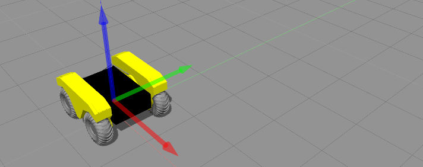
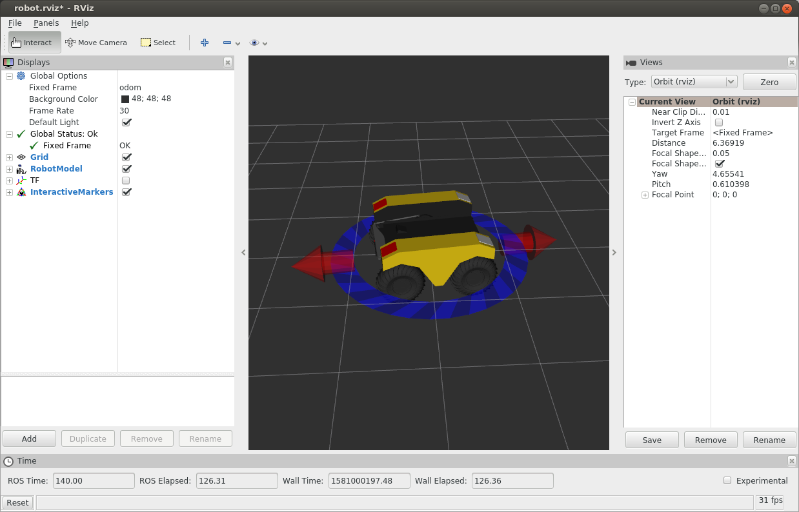

Simulating Warthog
====================

Whether you actually have a Warthog robot or not, the Warthog simulator is a great way to get started with ROS
robot development. In this tutorial, we will go through the basics of starting Gazebo and Rviz and how to drive
your Warthog around.

Installation
------------

To get started with the Warthog simulation, make sure you have a :roswiki:`working ROS installation <ROS/Installation>`
set up on your Ubuntu desktop, and install the Warthog-specific metapackages for desktop and simulation:

.. substitution-code-block :: bash

    sudo apt-get install ros-|ros_distro|-warthog-simulator ros-|ros_distro|-warthog-desktop

Launch Gazebo
-------------

Gazebo is the most common simulation tool used in ROS. Warthog's model in Gazebo include reasonable
approximations of its dynamics, including wheel slippage, skidding, and inertia. To launch simulated
Warthog in a simple example world, run the following command:

.. code-block:: bash

    roslaunch warthog_gazebo warthog_world.launch

You should see the following window appear, or something like it. You can adjust the camera angle by
clicking and dragging while holding CTRL, ALT, or the shift key:

.. image:: graphics/warthog_simulator_gazebo.png
    :alt: Simulated Warthog in the Race World.

The window which you are looking at is the Gazebo Client. This window shows you the "true" state of the
simulated world which the robot exists in. It communicates on the backend with the Gazebo Server, which
is doing the heavy lifting of actually maintaining the simulated world. At the moment, you're running
both the client and server locally on your own machine, but some advanced users may choose to run heavy
duty simulations on separate hardware and connect to them over the network.

Launch rviz
-----------

The next tool we will encounter is :roswiki:`rviz`. Although superficially similar in appearance to Gazebo,
rviz has a very different purpose— unlike Gazebo, which shows the reality of the simulated world, rviz shows
the robot's *perception* of its world, whether real or simulated. So while Gazebo won't be used with your
real Warthog, rviz is used with both.

You can using the following launch invocation to start rviz with a pre-cooked configuration suitable for
visualizing any standard Warthog config:

.. code-block:: bash

    roslaunch warthog_viz view_robot.launch

You should see rviz appear:

The rviz display only shows what the robot knows about its world, which presently, is nothing. Because the
robot doesn't yet know about the barriers which exist in its Gazebo world, they're not shown here.

Controlling Warthog
--------------------

What is shown, however, is Warthog's interactive markers. These are the simplest way to command your robot
to move around. If you don't see them in your rviz display, select the Interact tool from the top toolbar.
You should see red arrows and a blue circle appear around the Warthog model.

Drag the red arrows in Rviz to move in the linear x and the blue circle to move in the angular z. Rviz shows you
Warthog moving relative to its odometric frame, but it is also moving relative to the simulated world supplied by
Gazebo. If you click over to the Gazebo window, you will see Warthog moving within its simulated world. Or, if you
drive real Warthog using this method, it will have moved in the real world.

Once you start your own development, have your nodes send ``geometry_msgs/Twist`` commands to the ``cmd_vel``
topic to drive Warthog, either real or simulated. This is the standard ROS interface to differential-drive and
holonomic ground vehicles.

Non-Debian Systems
------------------------

If you cannot install the Warthog debian packages through the package manager, for example on an RPM-based Linux
distribution, or you need the ability to modify the simulation, you can create a catkin workspace and clone the
packages directly from github.  The following assumes  you have already installed ROS and catkin on your system.

First create a workspace directory and initialize it:

.. code-block:: bash

    mkdir ~/warthog_ws
    cd ~/warthog_ws
    mkdir src
    catkin_init_workspace src

Next clone the Warthog repositories using git:

.. code-block:: bash

    cd ~/warthog_ws/src
    git clone https://github.com/warthog-cpr/warthog.git
    git clone https://github.com/warthog-cpr/warthog_simulator.git
    git clone https://github.com/warthog-cpr/warthog_desktop.git

Now install additional ROS dependencies:

.. code-block:: bash

    cd ~/warthog_ws
    rosdep install --from-paths src --ignore-src --rosdistro=kinetic -y

Finally build the workspace:

.. code-block:: bash

    cd ~/warthog_ws
    catkin_make

You can now source your workspace's packages and run the simulation:

.. code-block:: bash

    cd ~/warthog_ws
    source devel/setup.bash
    roslaunch warthog_gazebo warthog_world.launch
