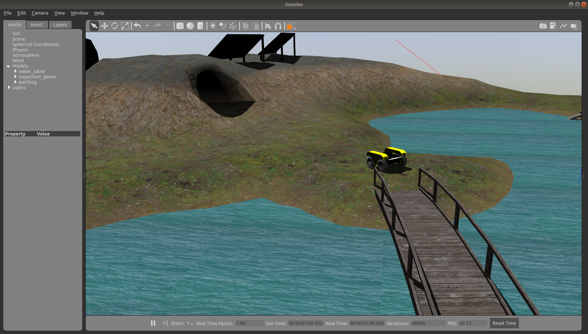
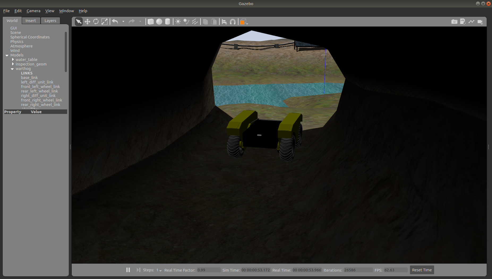
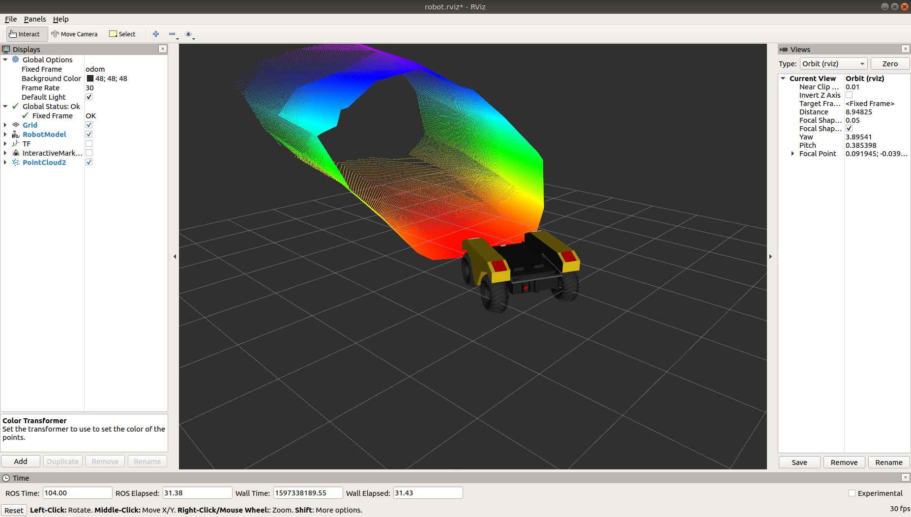
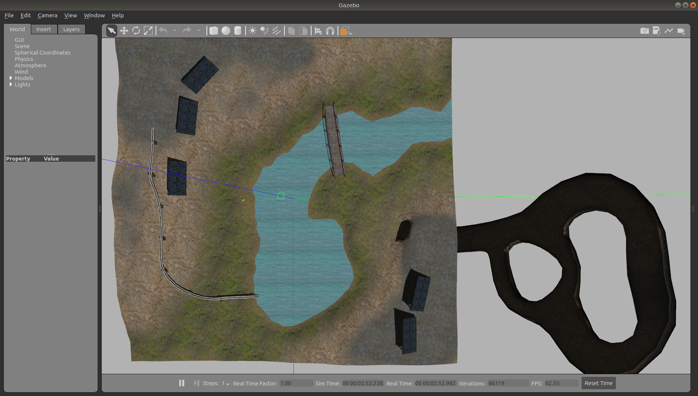
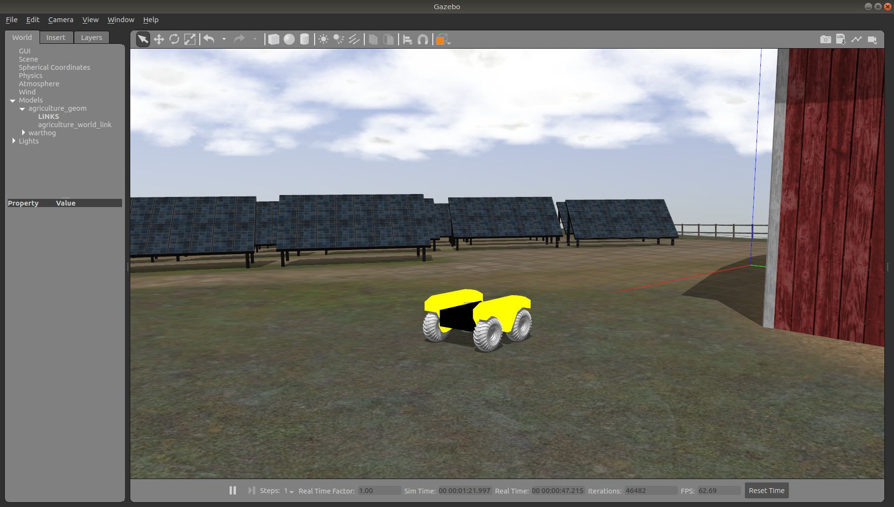
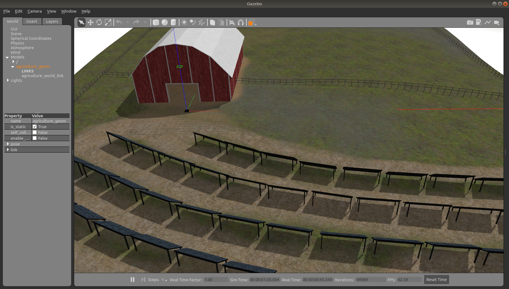
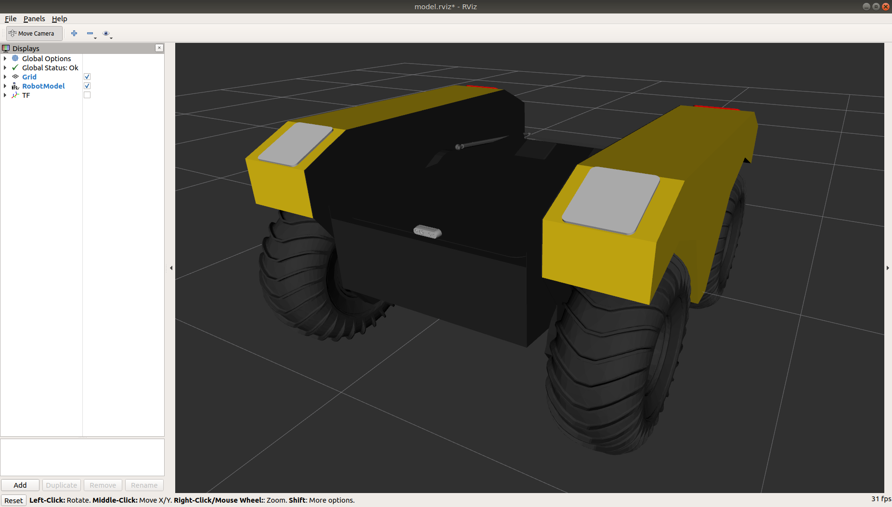

Additional Simulation Worlds
================================

In addtion to the default ``warthog_world.launch`` file, ``warthog_gazebo`` contains three additional launch files:

* ``empty_world.launch``, which spawns Warthog in a featureless, infinite plane;
* ``warthog_race.launch``, which spawns a world with lots of linear barriers; and
* ``spawn_warthog.launch``, which is intended to be included in any custom world to add a Warthog simulation to it.

To add a Warthog to any of your own worlds, simply include the ``spawn_warthog.launch`` file in your own world's launch:

.. code-block:: xml

  <include file="$(find warthog_gazebo)/launch/spawn_warthog.launch">
    <!-- Optionally configure the spawn position -->
    <arg name="x" value="$(arg x)"/>
    <arg name="y" value="$(arg y)"/>
    <arg name="z" value="$(arg z)"/>
    <arg name="yaw" value="$(arg yaw)"/>
  </include>

Finally, Clearpath provides an additional suite of simulation environments that can be downloaded separately and used
with Warthog, as described below.

Clearpath Gazebo Worlds
------------------------

The Clearpath Gazebo Worlds collection contains 4 different simulation worlds, representative of different
environments our robots are designed to operate in:

* Inspection World: a hilly outdoor world with water and a cave
* Agriculture World: a flat outdoor world with a barn, fences, and solar farm
* Office World: a flat indoor world with enclosed rooms and furniture
* Construction World: office world, under construction with small piles of debris and partial walls

Warthog is supported in Inspection and Agriculture Worlds.

Installation
---------------

To download the Clearpath Gazebo Worlds, clone the repository from github into the same workspace as your Warthog:

.. code-block:: bash

  cd ~/catkin_ws/src
  git clone https://github.com/clearpathrobotics/cpr_gazebo.git

Before you can build the package, make sure to install dependencies.  Because Clearpath Gazebo Worlds depends on
all of our robots' simulation packages, and some of these are currently only available as source code, installing
dependencies with ``rosdep install --from-paths [...]`` will likely fail.

All four simulation environments need the ``gazebo_ros`` package.  The Inspection World also needs the ``uuv_gazebo_worlds``
package, which can be installed by running

.. code-block:: bash

  sudo apt-get install ros-$ROS_DISTRO-uuv-gazebo-worlds

Once the dependencies are installed, you can build the package:

.. code-block:: bash

  cd ~/catkin_ws
  catkin_make
  source devel/setup.bash

Running the Inspection Simulation
------------------------------------

Inspection World is a hilly, outdoor world that includes a water feature, bridge, pipeline, small cave/mine,
and a small solar farm.  It is intended to simulate a variety of missions, including pipeline inspection,
cave/underground navigation, and localization on non-planar terrain.

To launch the inspection simulation, run

.. code-block:: bash

  roslaunch cpr_inspection_gazebo inspection_world.launch platform:=warthog

To customize Warthog's payload, for example to add additional sensors, see :ref:`customizepayload`.

Once the simulation is running you can use rviz and other tools as described in :doc:`WarthogSimulation`
to control and monitor the robot.  For example, below we can see Warthog exploring the cave:

and Warthog's perception of the inside of the cave as a 3D pointcloud in rviz:

You can see the complete layout of the Inspection World below:

Running the Agriculture Simulation
------------------------------------

Agriculture World is a flat, mixed indoor/outdoor world that include a large barn, open fields surrounded by fences,
and a large solar farm.  It is intended to simulate missions such as solar panel inspection and area coverage.

To launch the agriculture simulation, run

.. code-block:: bash

  roslaunch cpr_agriculture_gazebo agriculture_world.launch platform:=warthog

To customize Warthog's payload, for example to add additional sensors, see :ref:`customizepayload`.

Once the simulation is running you can use rviz and other tools as described in :doc:`WarthogSimulation`
to control and monitor the robot.

.. _customizepayload:

Customizing Warthog's Payload
-------------------------------

To customize Warthog's payload you must use the environment variables described in :doc:`WarthogPackages`.

You can add additional sensors by creating a customized URDF and setting the ``WARTHOG_URDF_EXTRAS`` environment
variable to point to it.

For example, let's suppose you want to equip Warthog with an Intel RealSense D435 camera.  First, install the ``realsense2_camera``
and ``realsense2_description`` packages, along with the gazebo plugins:

.. code-block:: bash

  sudo apt-get install ros-$ROS_DISTRO-realsense2-camera ros-$ROS_DISTRO-realsense2-description ros-$ROS_DISTRO-gazebo-plugins

Then create your customized URDF file, for example ``$HOME/Desktop/realsense.urdf.xacro``.  Put the following in it:

.. code-block:: xml

  <?xml version="1.0"?>
  <robot xmlns:xacro="http://ros.org/wiki/xacro">

    <link name="front_realsense" />

    <!--
      The gazebo plugin aligns the depth data with the Z axis, with X=left and Y=up
      ROS expects the depth data along the X axis, with Y=left and Z=up
      This link only exists to give the gazebo plugin the correctly-oriented frame
    -->
    <link name="front_realsense_gazebo" />
    <joint name="front_realsense_gazebo_joint" type="fixed">
      <parent link="front_realsense"/>
      <child link="front_realsense_gazebo"/>
      <origin xyz="0.0 0 0" rpy="-1.5707963267948966 0 -1.5707963267948966"/>
    </joint>

    <gazebo reference="front_realsense">
      <turnGravityOff>true</turnGravityOff>
      <sensor type="depth" name="front_realsense_depth">
        <update_rate>30</update_rate>
        <camera>
          <!-- 75x65 degree FOV for the depth sensor -->
          <horizontal_fov>1.5184351666666667</horizontal_fov>
          <vertical_fov>1.0122901111111111</vertical_fov>

          <image>
            <width>640</width>
            <height>480</height>
            <format>RGB8</format>
          </image>
          <clip>
            <!-- give the color sensor a maximum range of 50m so that the simulation renders nicely -->
            <near>0.01</near>
            <far>50.0</far>
          </clip>
        </camera>
        <plugin name="kinect_controller" filename="libgazebo_ros_openni_kinect.so">
          <baseline>0.2</baseline>
          <alwaysOn>true</alwaysOn>
          <updateRate>30</updateRate>
          <cameraName>realsense</cameraName>
          <imageTopicName>color/image_raw</imageTopicName>
          <cameraInfoTopicName>color/camera_info</cameraInfoTopicName>
          <depthImageTopicName>depth/image_rect_raw</depthImageTopicName>
          <depthImageInfoTopicName>depth/camera_info</depthImageInfoTopicName>
          <pointCloudTopicName>depth/color/points</pointCloudTopicName>
          <frameName>front_realsense_gazebo</frameName>
          <pointCloudCutoff>0.105</pointCloudCutoff>
          <pointCloudCutoffMax>8.0</pointCloudCutoffMax>
          <distortionK1>0.00000001</distortionK1>
          <distortionK2>0.00000001</distortionK2>
          <distortionK3>0.00000001</distortionK3>
          <distortionT1>0.00000001</distortionT1>
          <distortionT2>0.00000001</distortionT2>
          <CxPrime>0</CxPrime>
          <Cx>0</Cx>
          <Cy>0</Cy>
          <focalLength>0</focalLength>
          <hackBaseline>0</hackBaseline>
        </plugin>
      </sensor>
    </gazebo>

    <link name="front_realsense_lens">
      <visual>
        <origin xyz="0.02 0 0" rpy="${pi/2} 0 ${pi/2}" />
        <geometry>
          <mesh filename="package://realsense2_description/meshes/d435.dae" />
        </geometry>
        <material name="white" />
      </visual>
    </link>

    <joint type="fixed" name="front_realsense_lens_joint">
      <!-- Offset the camera to the front edge of the robot -->
      <origin xyz="0.60 0 0.01" rpy="0 0 0" />
      <parent link="top_chassis_link" />
      <child link="front_realsense_lens" />
    </joint>
    <joint type="fixed" name="front_realsense_joint">
      <origin xyz="0.025 0 0" rpy="0 0 0" />
      <parent link="front_realsense_lens" />
      <child link="front_realsense" />
    </joint>
  </robot>

This file defines the additional links for adding a RealSense camera to the robot, as well as configuring the ``openni_kinect``
plugin for Gazebo to simulate data from a depth camera.  The camera itself will be connected to the Warthog's ``front_mount``
link, offset 5cm towards the front of the robot.

Now, set the ``WARTHOG_URDF_EXTRAS`` environment variable and try viewing the Warthog model:

.. code-block:: bash

  export WARTHOG_URDF_EXTRAS=$HOME/Desktop/realsense.urdf.xacro
  roslaunch warthog_viz view_model.launch

You should see the Warthog model in rviz, with the RealSense camera mounted to it:

To launch the customized Warthog in any of the new simulation environments, similarly run:

.. code-block:: bash

  export WARTHOG_URDF_EXTRAS=$HOME/Desktop/realsense.urdf.xacro
  roslaunch cpr_inspection_gazebo inspection_world.launch platform:=warthog

You should see Warthog spawn in the office world with the RealSense camera:

You can view the sensor data from the RealSense camera by running

.. code-block:: bash

  roslaunch warthog_viz view_robot.launch

and adding the camera & pointcloud from the ``/realsense/color/image_raw`` and ``/realsense/depth/color/points`` topics:

